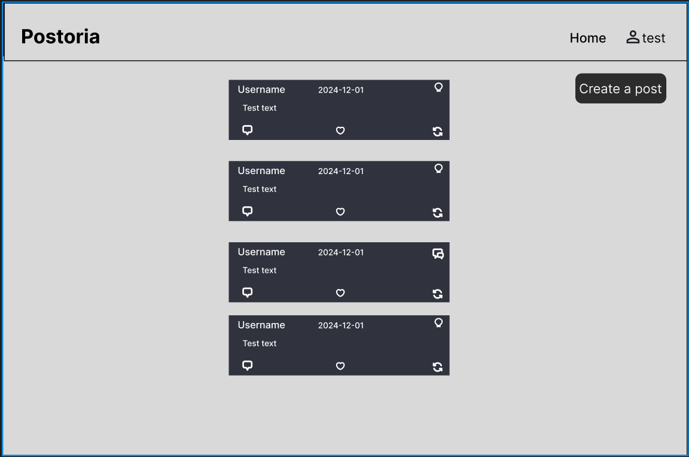

# T120B165-Web-Application-Design

Socialinis tinklas skirtas dalintis mintimis, bei kelti diskusijas problemos išspręsti - „Postoria“.

# Sprendžiamo uždavinio aprašymas
## 1. Sistemos paskirtis
**Postoria** – tai socialinė platforma, sujungianti mikroblogavimo ir diskusijų sprendimų funkcijas. Postoria leidžia vartotojams:
1.	**Dalintis mintimis:**  Vartotojai gali skelbti trumpas žinutes, įžvalgas, idėjas ar naujienas. Tai vieta greitai ir paprastai išreikšti savo mintis, diskutuoti aktualiomis temomis ar sekti kitų vartotojų įrašus.
2.	**Klausti ir diskutuoti:**  Vartotojai gali kurti detalesnius klausimus ar diskusijų temas, kaip forume, suskirstytas į įvairias kategorijas. Ši funkcija skirta gilinti žinias, spręsti problemas ar tiesiog dalyvauti platesnėse diskusijose su bendruomene.
3.	**Problemos sprendimas ir balsavimas:** Diskusijose ir klausimuose vartotojai gali pateikti atsakymus ar pasiūlymus, už kuriuos vėliau balsuojama kitų bendruomenės narių. Tai padeda išryškinti naudingiausius ir geriausius atsakymus ar sprendimus, padarant problemų sprendimą efektyvesniu.
Postoria yra dinamiška platforma, kurioje susijungia asmeninės mintys ir bendruomeniniai sprendimai. Tai vieta, kur žmonės gali ne tik dalintis idėjomis, bet ir bendrai spręsti iškilusias problemas įvairiose temose.

Postoria yra dinamiška platforma, kurioje susijungia asmeninės mintys ir bendruomeniniai sprendimai. Tai vieta, kur žmonės gali ne tik dalintis idėjomis, bet ir bendrai spręsti iškilusias problemas įvairiose temose.

## 2. Funkciniai reikalavimai
tai keletas funkcinių reikalavimų, kuriuos galėtumėte iškelti „Postoria“ sistemai:
1) Naudotojo paskyros ir autentifikacija
    -	Registracija: Vartotojai turi galėti užsiregistruoti.
    -	Prisijungimas: Vartotojai turi turėti galimybę prisijungti prie savo paskyros.
    -	Profilio valdymas: Vartotojai gali kurti, redaguoti ir peržiūrėti savo profilį (profilio nuotrauka, vartotojo vardas, aprašymas).
2) Turinio skelbimas
    -	Žinučių skelbimas: Vartotojai gali skelbti trumpus įrašus.
    -	Kategorijų pasirinkimas: Vartotojai gali priskirti savo žinutę vienai ar kelioms teminėms kategorijoms.
    -	Teksto redagavimas: Vartotojai gali redaguoti skelbtą turinį (tekstą, formatavimą, nuorodas).
    -	Komentavimas: Galimybė komentuoti kitų vartotojų įrašus.
3) Diskusijų forumas ir problemų sprendimas
    -	Klausimų skelbimas: Vartotojai gali užduoti klausimus ar pradėti diskusijas konkrečiomis temomis.
    -	Temų kategorijos: Klausimai turi būti priskirti tam tikroms kategorijoms ar žymoms (pvz., „technologijos“, „sveikata“, „automobiliai“,).
    -	Atsakymų skelbimas: Kiti vartotojai gali atsakyti į klausimus arba komentuoti diskusijas.
    -	Balsavimas už atsakymus: Vartotojai gali balsuoti (upvote/downvote) už atsakymus, siekiant išryškinti geriausius sprendimus.
    -	Geriausio atsakymo žymėjimas: Klausimo autorius gali pažymėti atsakymą kaip „geriausią“, kuris bus rodomas pirmiausia.
4) Paieška ir naršymas
    -	Paieška pagal raktinius žodžius: Vartotojai turi turėti galimybę ieškoti įrašų ir klausimų pagal raktinius žodžius, kategorijas ar temas.
    -	Filtravimas: Galimybė filtruoti turinį pagal populiarumą, datą, kategoriją ar kitus kriterijus.
5) Moderavimas ir valdymas
    -	Pranešti apie netinkamą turinį: Vartotojai gali pranešti apie netinkamą ar taisyklių neatitinkantį turinį.
    -	Moderatorių sistemos valdymas: Moderatoriai gali valdyti vartotojų pranešimus, turinio šalinimą, taisyklių pažeidimus ir užblokavimą.
6) Statistika ir analizė
    - Profilio statistika: Vartotojai gali matyti savo įrašų, klausimų ir atsakymų peržiūrų skaičių, balsavimus, patiktukus ir komentarus.

7) Vartotojų rolės ir jų teisės
Sistemoje bus įdiegtos kelios vartotojų rolės su skirtingomis prieigomis ir funkcijomis:

- Paprastas vartotojas (naudotojas)
    - Registracija ir prisijungimas: Gali registruotis, prisijungti ir valdyti savo paskyrą.
    - Turinio skelbimas: Gali skelbti žinutes, kurti klausimus, atsakyti į kitų vartotojų klausimus.
    - Balsavimas: Gali balsuoti už atsakymus ir įrašus, žymėti juos kaip naudingus arba nereikalingus.
    - Komentavimas: Gali komentuoti įrašus ir klausimus.
    - Profilio peržiūra: Gali matyti savo ir kitų vartotojų profilius.
    - Turinio filtravimas ir paieška: Gali naudotis paieškos funkcija ir filtruoti turinį pagal kategorijas ar raktinius žodžius.
    - Pranešimų siuntimas: Gali gauti pranešimus realiu laiku arba el. paštu apie atsakymus, balsavimus ir kitus veiksmus.

- Administratorius
    - Visi moderatoriams prieinami veiksmai: Gali atlikti visus moderatoriaus funkcijas.
    - Sistemos priežiūra: Gali administruoti visą platformą, įskaitant vartotojų valdymą, sistemų konfigūraciją ir techninę priežiūrą.
    - Vartotojų valdymas: Gali kurti, redaguoti ir šalinti vartotojų paskyras bei keisti jų roles.
    - Sistemos konfigūracija: Gali keisti svetainės parametrus, įdiegti naujas funkcijas ar koreguoti sistemos nustatymus.

- Svečias (neprisijungęs vartotojas)
    - Registracija: Gali susikurti paskyrą ir tapti paprastu vartotoju.
    - Prisijungimas: Gali prisijungti prie sistemos ir naudotis ja.

8. Rolės pagrįstas prieigos valdymas
    -	Rolės ir teisės: Sistema turi valdyti vartotojų teises pagal jų rolę. Kiekviena rolė turi savo prieigos lygius ir funkcijas.
    -	Rolės keitimas: Administratorius gali keisti vartotojų roles (pvz., priskirti moderatoriaus rolę).

Šie funkciniai reikalavimai apima pagrindinius „Postoria“ platformos veikimo aspektus ir padeda sukurti lanksčią ir patogią vartotojams sistemą.

## 3. Pasirinktų technologijų aprašymas

1) **Node.js**
Node.js yra atvirojo kodo JavaScript vykdymo aplinka, pagrįsta V8 JavaScript varikliu. Jis leidžia vykdyti JavaScript kodą serverio pusėje.
    - **Asinchroninė ir neblokiruojanti I/O**: Node.js naudoja neblokiruojančią I/O modelį, leidžiantį vienu metu apdoroti daug užklausų be uždelsimų.
    - **NPM (Node Package Manager)**: Node.js ateina su NPM, dideliu paketų ir bibliotekų saugykla, leidžiančia lengvai pridėti funkcionalumą.
    - **Skalabilumas**: Puikiai tinka realiu laiku veikiančioms aplikacijoms dėl savo efektyvumo ir našumo.
    - **Panaudojimas**: Node.js bus naudojamas kaip pagrindinė serverio pusės platforma, kurioje bus vykdomas visos aplikacijos kodas, įskaitant API logiką ir duomenų bazės sąveiką.

2) **Express.js**
Express.js yra minimalus ir lankstus Node.js web aplikacijų karkasas, kuris suteikia paprastą ir aiškų API, skirtą kurti serverio aplikacijas ir API.
    - **Lengva konfigūruoti**: Pateikia paprastą metodą tvarkyti HTTP užklausas ir atsakymus.
    - **Tarpinės programinės įrangos parama**: Leis lengvai pridėti įvairius middleware'us (pvz., autentifikaciją, klaidų tvarkymą).
    - **Didelė bendruomenė**: Dėl plačios bendruomenės ir dokumentacijos lengva rasti sprendimus ir pavyzdžius.
    - **Panaudojimas**: Express.js bus naudojamas kuriant REST API, valdyti HTTP užklausas (GET, POST, PUT, DELETE) ir integruojant įvairias tarpinės programinės įrangos funkcijas.

3) **MySQL**
MySQL yra populiari atvirojo kodo reliacinė duomenų bazė, plačiai naudojama įvairiose aplikacijose.
    - **Reliacinė struktūra**: Duomenys saugomi lentelėse, kuriose galima nustatyti tarpusavio ryšius.
    - **Transakcijos ir saugumas**: Palaiko ACID (Atomicity, Consistency, Isolation, Durability) principus, kad užtikrintų duomenų saugumą ir nuoseklumą.
    - **Plati palaikymo ekosistema**: Didelis dokumentacijos kiekis ir platus įrankių pasirinkimas.
    - **Panaudojimas**: MySQL bus naudojamas kaip pagrindinė duomenų bazė, kurioje bus saugomi visi duomenys apie temas, įrašus, komentarus ir vartotojus.

4) **React**
React yra populiari JavaScript biblioteka, skirta kurti vartotojo sąsajas.
    - **Komponentų pagrindas**: Leidžia kurti interaktyvias vartotojo sąsajas naudojant atskirus komponentus.
    - **Vienpusė duomenų srautų valdymas**: Užtikrina, kad duomenys būtų valdomi ir perduodami efektyviai.
    - **Panaudojimas**: React bus naudojamas kuriant dinamišką ir interaktyvią vartotojo sąsają, leidžiančią vartotojams sąveikauti su sistemą.

5) **JWT**
JWT yra standartas saugiems duomenų perdavimams tarp skirtingų sistemų, naudojant JSON objektus.
    - **Saugumo ypatybės**: JWT leidžia saugiai perduoti informaciją tarp serverio ir kliento, naudojant skaitmeninius parašus.
    - **Sesijų valdymas**: Naudojama sesijų valdymui, leidžia autentifikuoti ir autorizuoti vartotojus.
    - **Žetonų atnaujinimo strategija**: Naudojami atnaujinimo žetonai (refresh tokens) siekiant pratęsti sesijas be poreikio iš naujo autentifikuotis.
    - **Panaudojimas**: JWT bus naudojami autentifikacijai ir autorizacijai, leidžiant vartotojams prisijungti ir saugiai naudotis aplikacija.

6) **DigitalOcean**
Debesų kompiuterijos paslaugos leidžia talpinti ir valdyti aplikacijas internete.
    - **DigitalOcean**: Siūlo paprastą ir efektyvų būdą talpinti ir valdyti serverius, su patogiais įrankiais ir konkurencingomis kainomis.
    - **Panaudojimas**: Naudojami jūsų aplikacijos talpinimui ir valdymui debesyje, užtikrinant, kad jūsų produktas būtų prieinamas internetu.

7) **OpenAPI**
OpenAPI (Swagger) yra specifikacija, skirta API dokumentavimui ir testavimui.
    - **Automatinė dokumentacija**: Sukuria dokumentaciją pagal API aprašymą, kurį galima generuoti automatiškai.
    - **Testavimas**: Pateikia įrankius testuoti API užklausas tiesiogiai iš dokumentacijos.
    - **Panaudojimas**: Naudojamas dokumentuojant API metodus, kad būtų aišku, kaip sąsajos turėtų veikti ir kokios funkcijos yra prieinamos.

## 4. Naudotojo sąsajos projektas (wireframe)
#### Namų langas

#### Prisujungusio vartotojo namų langas

#### Pranešimo langas

#### Pranešimo kūrimo modalas

#### Pranešimo redagavimo

#### Komentaro rašymo modalas

## 5. Sistemos dizainas

## 6. UML "Deployment" Diagrama

